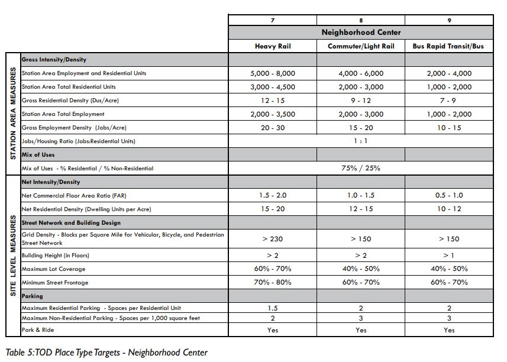
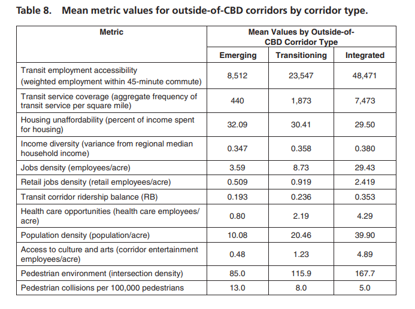
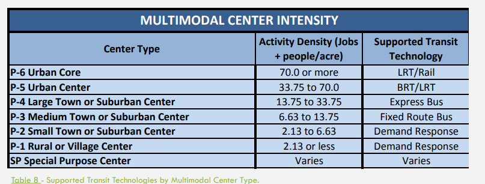

# Project
* Refine station locations
* Refine thresholds used in plots
* Adjust corridor to include downtown intermodal site, perhaps adding 1 alternate route
* Compare MPO land use data for base year to ACS/Census for reasonableness check
* Complete documentation on this site, perhaps adding technical documentation page
* Potentially add page describing TOD thresholds and include graphics from FDOT report
* Potentially incorporate output from TOD Readiness application, which in some respects provides more comprehensive station evaluation

# Methadology
* Enhance disaggregation methodology (using parcel or building footprint data)
* Add additional indicators contained in TOD guidebook (jobs-housing)
* Complete documentation on this site
* Improve graphics and potentially make them interactive

## FDOT TOD Guidebook Thresholds

## TCRP 187 Mean Values

## DRPT Multimodal Design Guidelines 

DRPT definition: Express bus services are offered in several areas of high demand, including the
Richmond Highway Express operating between Fort Belvoir along the Richmond Highway
to the Eisenhower and King Street Metrorail stops connecting to Washington, DC, and a
service that operates in the Dulles Corridor with connections to Metrorail. Similarly,
express routes operated by Hampton Roads Transit utilize high occupancy vehicle (HOV)
lanes in the congested Norfolk downtown and Naval Station areas.